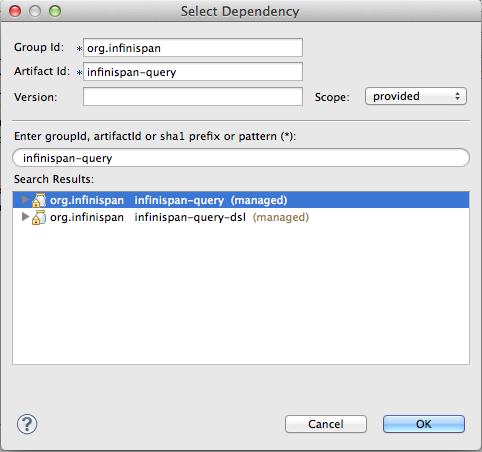

# JDG + EAP Lab 2 Guide
This explains the steps for lab 2, either follow them step-by-step or if you feel adventurous try to accomplish goals without the help of the step-by-step guide.

## Background 
In Lab 1 we implemented a side cache using JDG to speed up reads, but master data store is still the database. So far however the data access is only a using the common CRUD (Create, Read, Update and Delete) operations. Since JDG primary are a key/value store these operations are easy to implement. 

A competing vendor that has a similar task management solution released a new feature where users can filter their tasks. Something our customers has been requesting for a while. Our marketing director demands that we ASAP add this feature. An external consultant are hired and to implement this feature, but since he wasn't familiar with JDG he implemented the filter solution using JPA query. This is however not responsive enough and we refactor the filter function to query JDG instead.

JDG has very advanced querying capabilities in library mode (client/server quering is tech preview for JDG 6.3)

## Use-case
You are tasked to rewrite the filter implementation using queries in JDG instead of JPA queries. However the Task data model is used in the native mobile application and since it will take a while before we can update the mobile application you are not allowed to change the org.jboss.infinspan.demo.model.Task class.

## Objectives
Your task in Lab 2 re-implement the filtering method, but using JDG Queries. 
The UI and REST methods are already implemented.

Basically you should replace the DB Query with a JDG Query and you will have to 
do this without modifying the org.jboss.infinspan.demo.model.Task class. 

To to this we need to do the following:

1. Setup the lab environment
1. Add developer dependencies:
	Update the pom.xml and add developer dependency to infinispan-query
2. Add runtime dependencies
	Update jboss-deployment-structure.xml to add runtime dependency to infinispan-query
3. Update configuration
	Enable indexing in the API Configuration. Hint [See the Infinispan Query Index](http://red.ht/1nSniBo)
	  - The index should only be persisted in RAM
	  - Since we will later deploy this on mulitple EAP instances we need to allow for shared indexes.
	  - The index should be based on the `title` field from `org.jboss.infinspan.demo.model.Task`
4. Write the implementation to Query JDG
	Replace the implementation of `TaskSerivce.filter(String)` to query JDG instead of DB

## Step-by-Step

### Setup the lab environment
  To assist with setting up the lab environment we have provided a shell script that does this. 
  
  **Note:** _If you previously setup up lab 1 using this script there is no need to do this for lab 2__

  1. Run the shell script by standing in the jdg lab root directory (~/jdg-labs) execute a command like this

    		$ sh init-lab.sh --lab=2

### Add developer dependencies

1. Open the lab2 pom.xml (see below)
2. Select the dependencies tab

  	
  
3. Click **Add...** button
4. Type `infinispan-query` in the search field and select the managed version that should appear.

  	
  
5. Change **Scope** to `provided` and Click **OK**
6. Select the newly added dependency and click **Properties...**
7. Verify the Type value is Jar. If it's bundle instead switch it to jar or delete bundle.
  
  	
  
### Add runtime dependencies

1. Open `src/main/webapp/WEB-INF/jboss-deployment-structure.xml` 
1. Add `org.infinispan.query` module. The content of the file should look like this:

		<jboss-deployment-structure>
			<deployment>
				<dependencies>
					<module name="org.infinispan" slot="jdg-6.3" services="import"/>
					<module name="org.infinispan.cdi" slot="jdg-6.3" meta-inf="import"/>
					<module name="org.infinispan.query" slot="jdg-6.3" services="import"/>
				</dependencies>
			</deployment>
		</jboss-deployment-structure>

1. After saving It's recommended to run the JUnit test to verify that everything deploys fine.

### Update the configuration

1. Open `src/main/java/org/jboss/infinispan/demo/Config.java`
1. After the global configuration we need to create a `SearchMapping` object that tells JDG how to index `Task` objects 

		SearchMapping mapping = new SearchMapping();
		mapping.entity(Task.class).indexed().providedId()
			.property("title", ElementType.METHOD).field();
			
1. Create a `Properties` object and store the `SearchMapping` object under the `org.hibernate.search.Environment.MODEL_MAPPING` key.

		Properties properties = new Properties();
			properties.put(org.hibernate.search.Environment.MODEL_MAPPING, mapping);

1. We also need to tell JDG (or Lucene) to store the indexes in ram memory by adding a property with key "default.directory_provider" and value "key". 

		properties.put("default.directory_provider", "ram");
		
1. Now we can enable the index on the configuration object by adding `.indexing().enable()` to the fluid API before `.build()`.
1. Also we want to configure the index to support clustering adding `.indexLocalOnly(false)` to the fluid API before `.build()`.
1. And finally we want to pass in the properties configuration by adding `.withProperties(properties)` to the fluid API before `.build()`. The config class should now look like this:

		package org.jboss.infinispan.demo;

		import java.lang.annotation.ElementType;
		import java.util.Properties;

		import javax.annotation.PreDestroy;
		import javax.enterprise.context.ApplicationScoped;
		import javax.enterprise.inject.Default;
		import javax.enterprise.inject.Produces;

		import org.hibernate.search.cfg.SearchMapping;
		import org.infinispan.configuration.cache.Configuration;
		import org.infinispan.configuration.cache.ConfigurationBuilder;
		import org.infinispan.configuration.global.GlobalConfiguration;
		import org.infinispan.configuration.global.GlobalConfigurationBuilder;
		import org.infinispan.eviction.EvictionStrategy;
		import org.infinispan.manager.DefaultCacheManager;
		import org.infinispan.manager.EmbeddedCacheManager;
		import org.jboss.infinispan.demo.model.Task;

		/**
		 * This is Class will be used to configure JDG Cache
		 * @author tqvarnst
		 * 
		 * DONE: Add configuration to enable indexing of title field of the Task class
		 *
		 */
		public class Config {

			private EmbeddedCacheManager manager;

			@Produces
			@ApplicationScoped
			@Default
			public EmbeddedCacheManager defaultEmbeddedCacheConfiguration() {
				if (manager == null) {
					GlobalConfiguration glob = new GlobalConfigurationBuilder()
							.globalJmxStatistics().allowDuplicateDomains(true).enable() // This
							// method enables the jmx statistics of the global
							// configuration and allows for duplicate JMX domains
							.build();
			
					SearchMapping mapping = new SearchMapping();
					mapping.entity(Task.class).indexed().providedId()
						  .property("title", ElementType.METHOD).field();
			 
					Properties properties = new Properties();
					properties.put(org.hibernate.search.Environment.MODEL_MAPPING, mapping);
					properties.put("default.directory_provider", "ram");
		
			
					Configuration loc = new ConfigurationBuilder().jmxStatistics()
							.enable() // Enable JMX statistics
							.eviction().strategy(EvictionStrategy.NONE) // Do not evic objects
							.indexing()
								.enable()
								.indexLocalOnly(false)
								.withProperties(properties)
							.build();
					manager = new DefaultCacheManager(glob, loc, true);
				}
				return manager;
			}

			@PreDestroy
			public void cleanUp() {
				manager.stop();
				manager = null;
			}
		}
 

### Write the implementation to Query JDG

1. Open `src/main/java/org/jboss/infinispan/demo/TaskService.java`
1. Navigate to the `public Collection<Task> filter(String input)` and delete the current DB implementation
1. In order create QueryBuilder and run that query we need a `SearchManager` object. We can get that by calling `Search.getSearchManager(cache)`
		
		SearchManager sm = Search.getSearchManager(cache);
		
1. To create a `QueryBuilder` object we can then get a `SearchFactory` from the `SearchManager` and call `buildQueryBuilder().forEntity(Task.class).get()` on it.
		
		QueryBuilder qb = sm.getSearchFactory().buildQueryBuilder().forEntity(Task.class).get();
		
1. Now we can create a `Query` object from the `QueryBuilder` using the fluid api to specify which Field to match etc.

		Query q = qb.keyword().onField("title").matching(input).createQuery();

1. We can now get a `CacheQuery` object by using the `SearchManager.getQuery(...)` method.
		
		CacheQuery cq = sm.getQuery(q, Task.class);	
		
1. The `CacheQuery` extends `Iterable<Object>` directly, but since we are expecting a `Collection<Task>` to return we will have to call `CacheQuery.list()` to get a `List<Object>` back. This will now have to be cast to typed Collection using double Casting.

		return (Collection<Task>)(List)cq.list();
		
	Note that since we are using a QueryBuilder specifically for Task.class we can safely do this cast.
	
1. You also need to add the following import statement if you IDE doesn't fix that

	
		import org.apache.lucene.search.Query;
		import org.hibernate.search.query.dsl.QueryBuilder;
		import org.infinispan.query.Search;

### Test and deploy
Now you are almost finished with Lab 2, you should run the Arquillian tests and then deploy the application.
